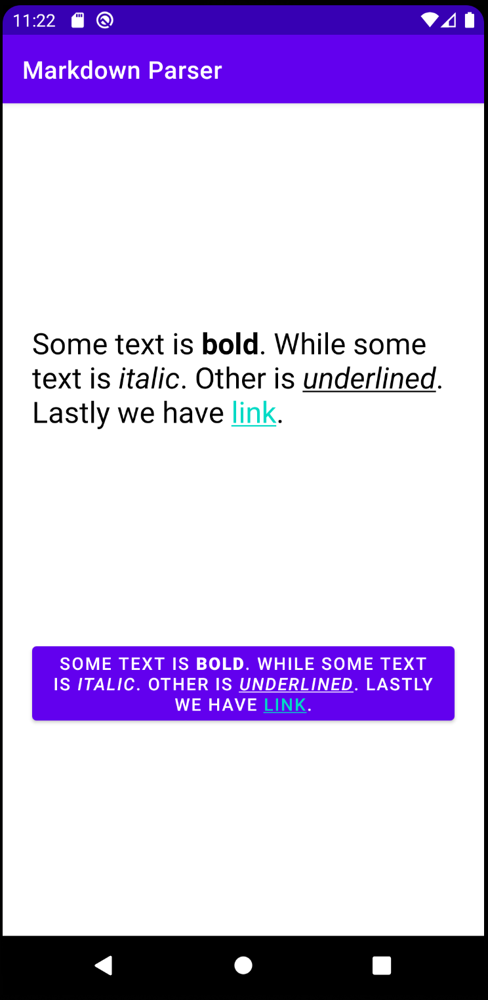

MarkdownParser
---

This is a simple POC to parse a subset of markdown and render it in Android and iOS.

### Supported Markdown Styles

This POC tries to handle the following markdown styles:

- bold: `**bold**`
- underline: `__underline__`
- italic: `_italic_`
- hyperlink: `[link text](http://google.com)`

### Shared
- [MarkdownParser.kt](/shared/src/commonMain/kotlin/net/ralphpina/markdownparser/shared/MarkdownParser.kt): exposes a parse() method that returns the copy and a list of entities.

### Android
- [AndroidMarkdownRenderer.kt](/androidApp/src/main/java/net/ralphpina/markdownparser/androidApp/AndroidMarkdownRenderer.kt): exposes a couple of extension methods to add markdown to a `TextView` and `Button`.

### iOS
- TODO: we need to implement this, probably using [NSAttributedString or UIFont](https://stackoverflow.com/questions/25025779/setting-uilabel-text-to-bold). I need to explore this.

- We welcome contributions :)

Thus, the following copy: `"Some text is **bold**. While some text is _italic_. Other is __underlined__. Lastly we have [link](http://google.com)."`

Used like so in **Android**:

```kotlin
val textView = findViewById<TextView>(R.id.text_view)
val button = findViewById<Button>(R.id.button)
textView.renderMarkdown(markdown)
button.renderMarkdown(markdown)
```

Is rendered like so:
